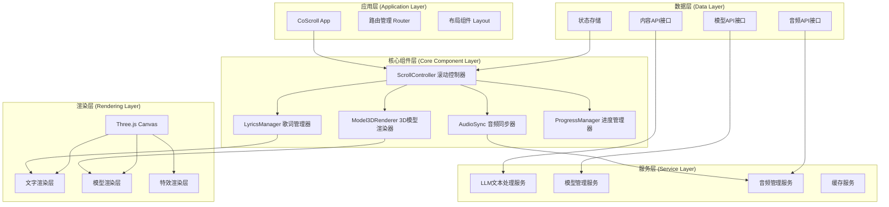
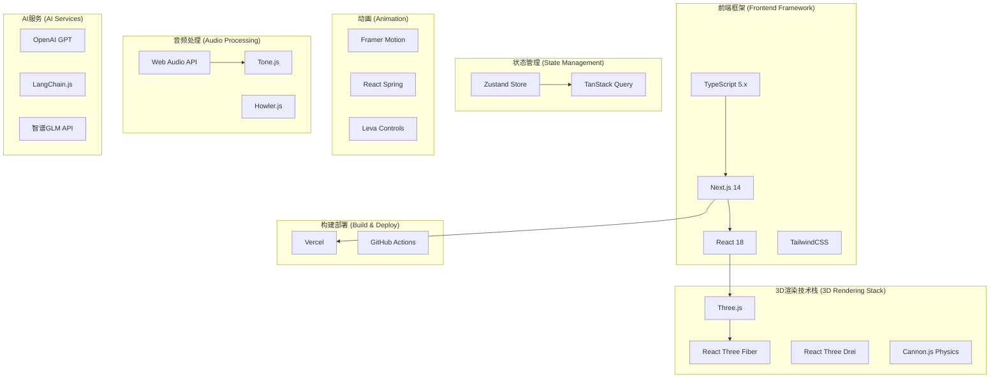
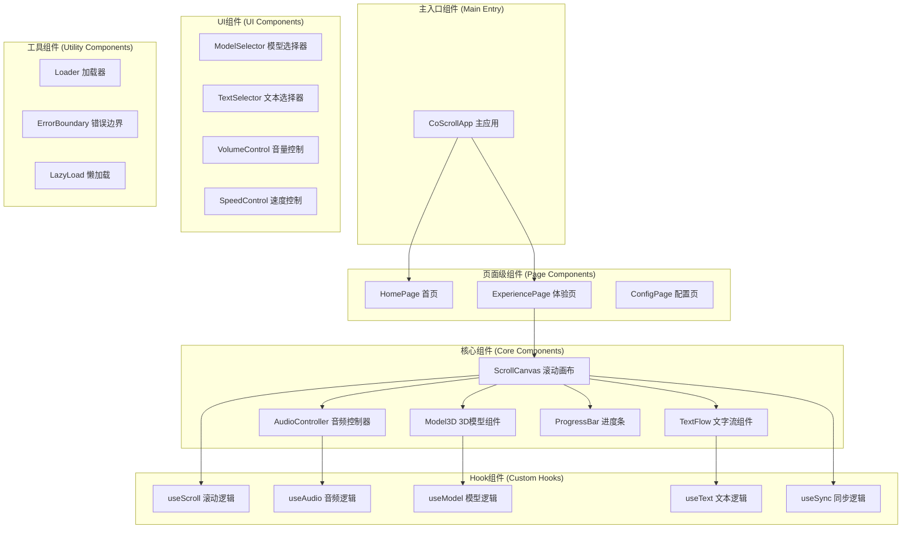
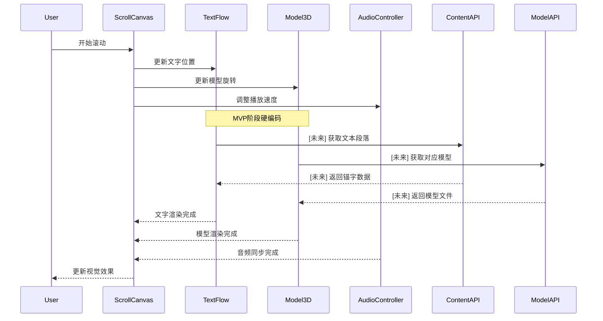
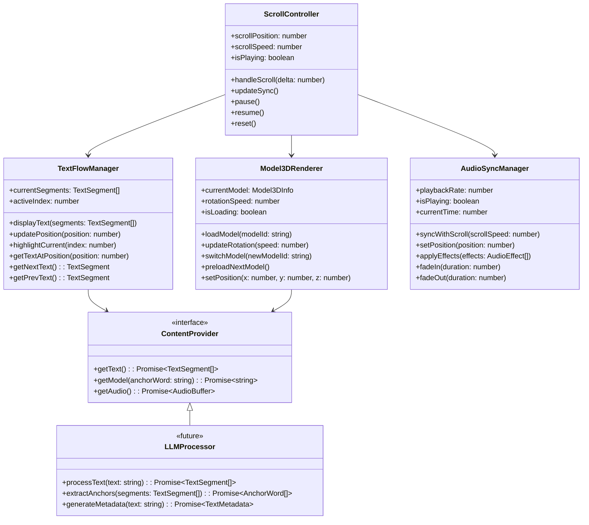
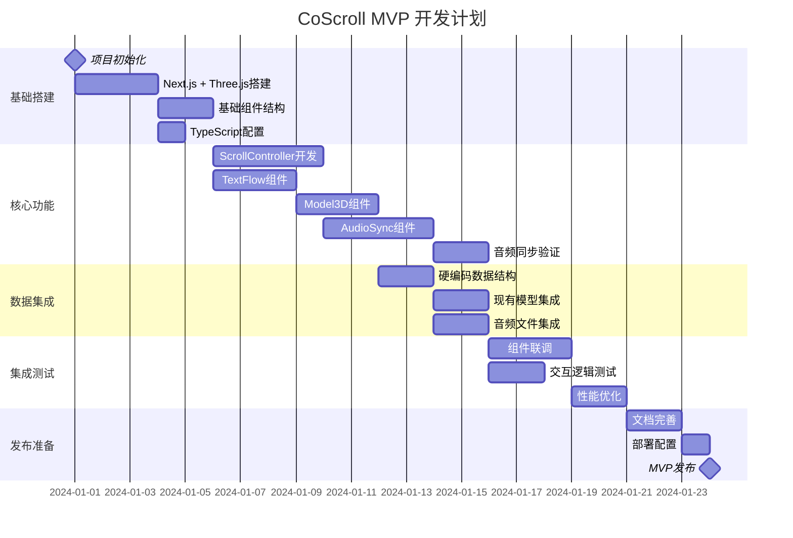

# CoScroll MVP 实现文档

## 1. 项目概述

CoScroll 是一个结合滚动交互、3D书法模型和音频同步的数字经卷体验应用。本文档描述了 MVP 阶段的技术架构设计和实现方案。

**核心交互逻辑：**
- 文字往上滚动，一行在3D模型前方，一行在模型后方交替显示
- 3D书法模型根据滚动速度同步旋转
- 音频播放速度与滚动速度同步
- 本质上是歌词滚动 + 3D视觉 + 进度条控制的结合体

## 2. 整体架构设计



## 3. 技术栈选型



### 技术选型理由

**前端框架：**
- **Next.js 14** - SSR/SSG支持，性能优化，部署简单
- **React 18** - Concurrent Features，更好的用户体验
- **TypeScript** - 类型安全，大型项目维护性

**3D渲染：**
- **Three.js + React Three Fiber** - React生态集成度高
- **@react-three/drei** - 丰富的组件库，快速开发
- **WebGL 2.0** - 现代浏览器支持，性能优秀

**音频处理：**
- **Web Audio API** - 原生支持，低延迟
- **Tone.js** - 音频处理抽象层，效果丰富

**状态管理：**
- **Zustand** - 轻量级，适合复杂同步需求
- **TanStack Query** - 处理异步数据和缓存，减少自定义请求逻辑

> **MVP说明**：统一使用 Next.js + Zustand + TanStack Query，避免同时维护多套状态方案。

## 4. 组件化架构设计



## 5. 数据流和交互设计



## 6. 预留接口设计

### 6.1 文本处理接口

```typescript
// 文本处理接口
interface ITextProcessor {
  // LLM文本分段
  segmentText(text: string): Promise<TextSegment[]>
  // 提取锚字
  extractAnchorWords(segments: TextSegment[]): Promise<AnchorWord[]>
  // 生成文本元数据
  generateMetadata(text: string): Promise<TextMetadata>
}

// 模型管理接口
interface IModelManager {
  // 获取模型列表
  getModelList(): Promise<Model3DInfo[]>
  // 根据锚字匹配模型
  matchModelByAnchor(anchorWord: string): Promise<string>
  // 预加载模型
  preloadModel(modelId: string): Promise<void>
  // 获取模型文件
  getModelFile(modelId: string): Promise<ArrayBuffer>
}

// 音频管理接口
interface IAudioManager {
  // 加载音频文件
  loadAudio(audioId: string): Promise<AudioBuffer>
  // 设置播放速度
  setPlaybackRate(rate: number): void
  // 设置音效
  setEffects(effects: AudioEffect[]): void
  // 同步播放位置
  syncPosition(position: number): void
}
```

### 6.2 数据类型定义

```typescript
// 数据类型定义
interface TextSegment {
  id: string
  content: string
  startIndex: number
  endIndex: number
  anchorWord?: string
  duration?: number
}

interface AnchorWord {
  word: string
  confidence: number
  modelId?: string
  position: number
}

interface Model3DInfo {
  id: string
  name: string
  filePath: string
  category: string
  tags: string[]
  fileSize: number
}

interface AudioEffect {
  type: 'reverb' | 'delay' | 'filter'
  params: Record<string, number>
}

interface TextMetadata {
  totalDuration: number
  segmentCount: number
  theme: string
  difficulty: number
}
```

## 7. MVP阶段硬编码数据

```typescript
// MVP阶段硬编码数据
const MVP_DATA = {
  // 心经文本 (硬编码分段)
  heartSutra: {
    id: 'heart_sutra',
    title: '般若波罗蜜多心经',
    segments: [
      {
        id: '1',
        content: '观自在菩萨',
        anchorWord: '观',
        modelId: 'guan',
        duration: 3000
      },
      {
        id: '2',
        content: '行深般若波罗蜜多时',
        anchorWord: '行',
        modelId: 'xing',
        duration: 5000
      },
      {
        id: '3',
        content: '照见五蕴皆空',
        anchorWord: '照',
        modelId: 'zhao',
        duration: 4000
      },
      {
        id: '4',
        content: '度一切苦厄',
        anchorWord: '度',
        modelId: 'du',
        duration: 4000
      },
      // 更多分段...
    ]
  },

  // 模型映射 (硬编码)
  models: {
    'dao': {
      id: 'dao',
      name: '道',
      filePath: '/model/10k/003_道.glb',
      category: 'philosophy',
      tags: ['道家', '哲学'],
      fileSize: 1024000
    },
    'guan': {
      id: 'guan',
      name: '观',
      filePath: '/model/10k/001_观.glb', // 假设未来添加
      category: 'buddhism',
      tags: ['佛教', '观想'],
      fileSize: 1024000
    },
    // 更多模型...
  },

  // 音频文件 (硬编码)
  audio: {
    heartSutra: {
      id: 'heart_sutra_audio',
      filePath: '/audio/heart_sutra.mp3',
      duration: 180000, // 3分钟
      bpm: 60
    }
  }
}
```

## 8. 核心组件类设计



## 9. 项目目录结构

```
CoScroll/
├── src/
│   ├── components/           # 组件目录
│   │   ├── core/            # 核心组件
│   │   │   ├── ScrollCanvas.tsx      # 主滚动画布
│   │   │   ├── TextFlow.tsx          # 文字流组件
│   │   │   ├── Model3D.tsx           # 3D模型组件
│   │   │   ├── AudioController.tsx   # 音频控制器
│   │   │   └── ProgressBar.tsx       # 进度条
│   │   ├── ui/              # UI组件
│   │   │   ├── ModelSelector.tsx     # 模型选择器
│   │   │   ├── TextSelector.tsx      # 文本选择器
│   │   │   ├── VolumeControl.tsx     # 音量控制
│   │   │   └── SpeedControl.tsx      # 速度控制
│   │   └── layout/          # 布局组件
│   │       ├── Header.tsx
│   │       ├── Footer.tsx
│   │       └── Layout.tsx
│   ├── hooks/               # 自定义Hook
│   │   ├── useScroll.ts     # 滚动逻辑Hook
│   │   ├── useAudio.ts      # 音频逻辑Hook
│   │   ├── useModel.ts      # 模型逻辑Hook
│   │   ├── useText.ts       # 文本逻辑Hook
│   │   └── useSync.ts       # 同步逻辑Hook
│   ├── services/            # 服务层
│   │   ├── contentProvider.ts        # 内容提供服务
│   │   ├── modelManager.ts           # 模型管理服务
│   │   ├── audioManager.ts           # 音频管理服务
│   │   └── llmProcessor.ts           # LLM处理服务(未来)
│   ├── stores/              # 状态管理
│   │   ├── scrollStore.ts            # 滚动状态
│   │   ├── contentStore.ts           # 内容状态
│   │   ├── audioStore.ts             # 音频状态
│   │   └── appStore.ts               # 应用全局状态
│   ├── types/               # 类型定义
│   │   ├── content.types.ts          # 内容相关类型
│   │   ├── model.types.ts            # 模型相关类型
│   │   ├── audio.types.ts            # 音频相关类型
│   │   └── app.types.ts              # 应用通用类型
│   ├── utils/               # 工具函数
│   │   ├── mathUtils.ts              # 数学计算工具
│   │   ├── audioUtils.ts             # 音频处理工具
│   │   └── modelUtils.ts             # 模型处理工具
│   ├── data/               # 硬编码数据
│   │   ├── mvp-content.ts            # MVP内容数据
│   │   ├── model-mapping.ts          # 模型映射数据
│   │   └── audio-config.ts           # 音频配置数据
│   └── styles/             # 样式文件
│       ├── globals.css
│       └── components.css
├── public/
│   ├── models/             # 3D模型文件
│   │   └── 10k/
│   │       ├── 003_道.glb           # 现有模型
│   │       └── [未来更多模型]
│   ├── audio/              # 音频文件
│   │   └── heart_sutra.mp3
│   └── images/             # 图片资源
├── docs/                   # 文档
│   ├── architecture.md
│   ├── api.md
│   └── deployment.md
├── tests/                  # 测试文件
│   ├── components/
│   ├── hooks/
│   └── utils/
├── package.json
├── tsconfig.json
├── next.config.js
├── tailwind.config.js
└── README.md
```

## 10. MVP开发计划



## 11. 关键实现细节

### 11.1 滚动同步算法

```typescript
// 滚动速度到旋转速度的映射
const scrollToRotation = (scrollSpeed: number): number => {
  const normalizedSpeed = Math.abs(scrollSpeed) / 100
  const maxRotationSpeed = Math.PI / 30 // 每帧最大旋转角度
  return Math.min(normalizedSpeed * maxRotationSpeed, maxRotationSpeed)
}

// 滚动速度到音频播放倍速的映射
const scrollToPlaybackRate = (scrollSpeed: number): number => {
  const baseRate = 1.0
  const speedFactor = scrollSpeed / 100
  return Math.max(0.5, Math.min(2.0, baseRate + speedFactor))
}
```

### 11.2 文字层级渲染

```typescript
// 文字分层显示逻辑
interface TextLayer {
  front: TextSegment    // 模型前方文字
  back: TextSegment     // 模型后方文字
  current: number       // 当前段落索引
}

const updateTextLayers = (
  segments: TextSegment[],
  currentIndex: number
): TextLayer => {
  return {
    front: segments[currentIndex] || null,
    back: segments[currentIndex + 1] || segments[0], // 循环显示
    current: currentIndex
  }
}
```

### 11.3 性能优化策略

1. **模型预加载**：提前加载下一个模型
2. **音频流式播放**：避免大文件加载阻塞
3. **文字渲染缓存**：复用文字纹理
4. **LOD优化**：根据距离调整模型精度

### 11.4 音频同步验证策略

1. 基于 Web Audio API 的 `playbackRate` 仅做临时倍速演示，默认会影响音高
2. MVP 阶段验证 Tone.js / Howler.js 在变速时的表现，评估是否需要自定义 time-stretch 方案
3. 若需保持音高稳定，预研 AudioWorklet + Phase Vocoder 或引入现成变速库，并在后续迭代规划中落实
4. 在交互测试前完成上述验证结论，确保滚动与音频同步体验一致

## 12. 风险与挑战

### 12.1 技术风险
- **音频同步精度**：Web Audio API在不同浏览器的表现差异
- **3D性能**：移动端WebGL性能限制
- **滚动流畅性**：高频率事件处理可能导致性能瓶颈

### 12.2 解决方案
- **音频同步**：使用AudioWorklet实现更精确的时间控制
- **性能优化**：实现自适应品质调节
- **兼容性**：提供降级方案，确保基础功能可用

## 13. 后续扩展计划

### 13.1 第二阶段：AI集成
- 集成LLM文本分析API
- 实现自动锚字提取
- 支持用户自定义文本输入

### 13.2 第三阶段：模型扩展
- 构建100+书法模型库
- 实现智能模型匹配
- 支持用户上传自定义模型

### 13.3 第四阶段：商业化
- B端定制服务
- 3D扫描集成
- 数字文创产品输出

## 14. 总结

本MVP实现文档提供了CoScroll项目的完整技术架构设计，具备以下特点：

✅ **组件化程度高** - 核心功能独立，易于维护和扩展
✅ **接口预留合理** - 为LLM集成和模型扩展留足空间
✅ **MVP可快速实现** - 硬编码方案可快速验证核心交互
✅ **扩展性强** - 未来可无缝接入AI服务和更多模型
✅ **技术栈统一** - Next.js + React 18 + Three.js + TypeScript + Vercel 部署链路清晰

通过这个架构设计，可以快速构建出一个功能完整、性能优秀的MVP版本，同时为后续的功能扩展和商业化奠定坚实的技术基础。音频变速验证与精简依赖策略也确保 MVP 迭代保持聚焦，降低实现风险。
